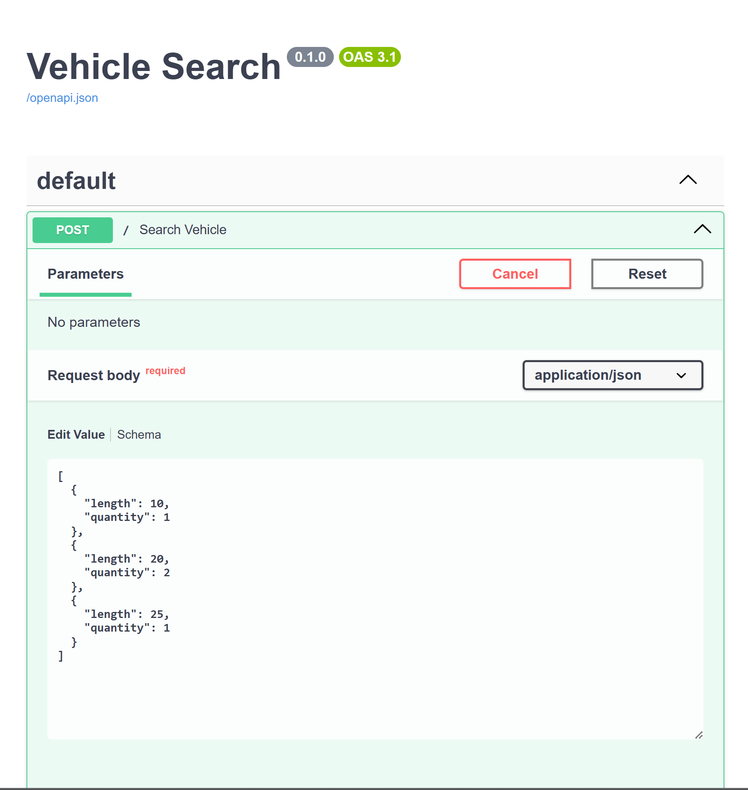
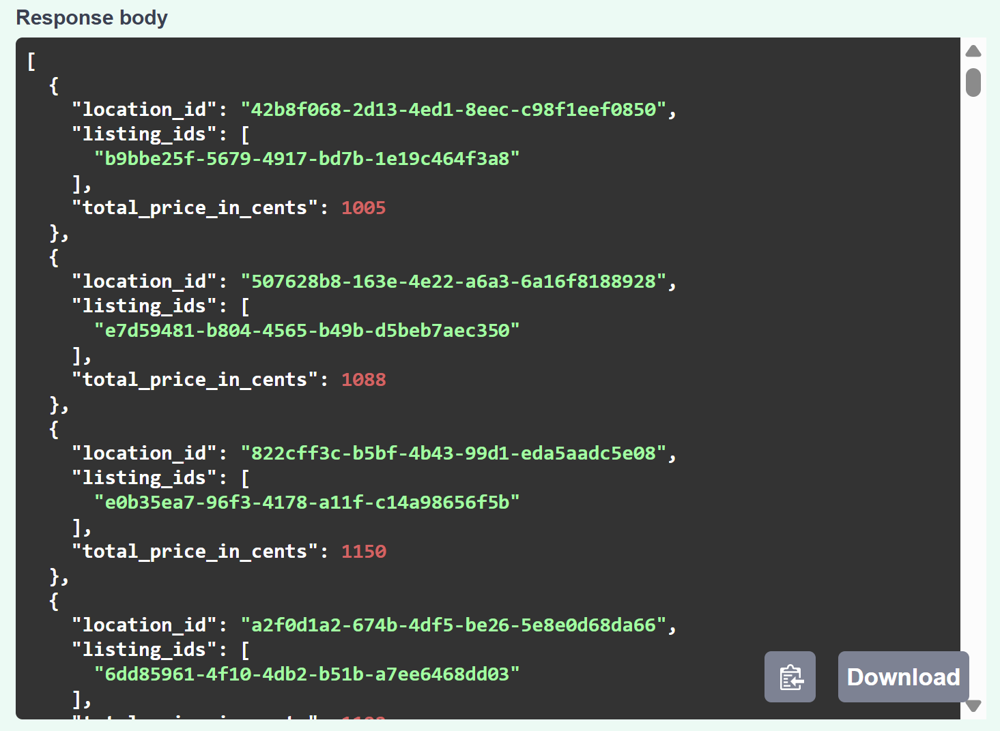

<!-- About the project -->
## :star2: About the Project

<a>A search algorithm that allows renters to find locations where they can store multiple vehicles.</a>
<div align="center"> 
  
  
</div>


<!-- TechStack -->
### :space_invader: Tech Stack

  <ul>
    <li><a href="https://www.python.org/">Python</a></li>
    <li><a href="https://fastapi.tiangolo.com/">FastAPI</a></li>
    <li><a href="https://uvicorn.dev/">Uvicorn</a></li>
    <li><a href="https://docs.pydantic.dev/latest/">Pydantic</a></li>
    <li><a href="https://docs.pytest.org/en/stable/">Pytest</a></li>
  </ul>

<!-- Features -->
### :dart: Features

- Feature 1
- Feature 2
- Feature 3

<!-- Run Locally -->
### :running: Run Locally

Clone the project

```bash
  git clone https://github.com/spencerlore/vehicle-search-project
```

Go to the project directory

```bash
  cd vehicle-search-project
```

Create a virtual environment and install dependencies

```bash
python -m venv .venv
source .venv/bin/activate
pip install -r requirements.txt
```

Start the API server

```bash
python -m uvicorn app.main:app --reload --port 8000
```

Open in browser
```bash
http://127.0.0.1:8000/docs
```

Click the "try it out" button and send a request. Example:
```bash
[
  {
    "length": 10,
    "quantity": 1
  },
  {
    "length": 20,
    "quantity": 2
  },
  {
    "length": 25,
    "quantity": 1
  }
]
```

<!-- Usage -->
## :eyes: Usage

Use this space to tell a little more about your project and how it can be used. Show additional screenshots, code samples, demos or link to other resources.


```javascript
import Component from 'my-project'

function App() {
  return <Component />
}
 - [Awesome README](https://github.com/matiassingers/awesome-readme)
 - [Emoji Cheat Sheet](https://github.com/ikatyang/emoji-cheat-sheet/blob/master/README.md#travel--places)
 - [Readme Template](https://github.com/othneildrew/Best-README-Template)
